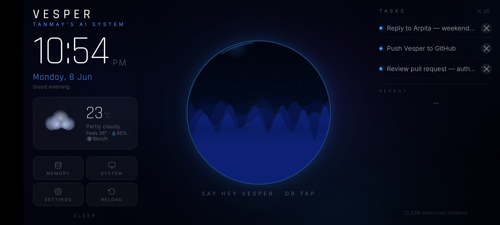
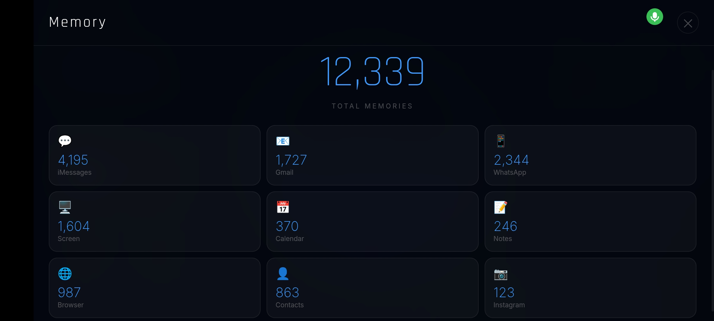
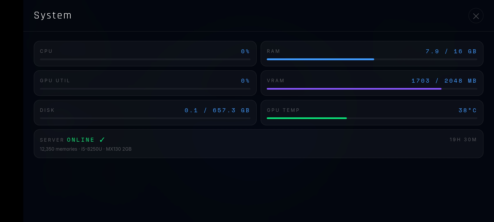

# VESPER — Personal Life AI / Second Brain

> *"An AI that has actually read your messages, knows your schedule, and remembers what you were working on last Tuesday — running privately on hardware you own."*

Built by **Tanmay Pramanick**. Vesper is a fully self-hosted, always-on personal AI — a **second brain** — that ingests your entire digital life into a local vector database and lets you query it by voice, WhatsApp, or a desk kiosk display. No cloud. No subscriptions. No data leaves the house.

---

## Kiosk UI

| Home | Memory | System | Settings |
|------|--------|--------|----------|
|  |  |  |  |

*Always-on desk display — OnePlus Nord running Fully Kiosk Browser.*

---

## Why I Built This

Every AI assistant you talk to is completely stateless. Ask it what you were working on last Tuesday — it doesn't know. Ask about someone you've been texting — it doesn't know. Ask it to recall that email from last week — it doesn't know.

Cloud AI (ChatGPT, Siri, Google Assistant) either stores nothing or stores everything on their servers, training on your conversations to improve their products.

I wanted something different:

- **Actually personal** — has read your messages, knows who people in your life are, remembers your context
- **Private** — all data on local hardware, zero cloud
- **Always available** — voice at your desk, WhatsApp from anywhere, kiosk display always on
- **Accumulating** — every day it knows more. Gets smarter about you specifically, not everyone

The result is something that feels less like a search engine and more like an assistant who has been quietly watching and remembering everything about your life for months.

---

## Architecture

```
┌──────────────────── HOME NETWORK ────────────────────────────────┐
│                                                                   │
│  MacBook Pro (M-series)          VESPER SERVER (10.0.0.120)      │
│  ─────────────────────           ───────────────────────────     │
│  vesper_capture.py  ──────────►  file_receiver.py  (Flask HTTPS) │
│  vesper_audio.py    ──────────►  ├─ ChromaDB  (vesper_life)      │
│  gmail_realtime.py  ──────────►  │  12,000+ memories             │
│  export_*.sh crons  ──────────►  ├─ Ollama  (LLM + embeddings)  │
│                                  ├─ Piper TTS  (CPU)             │
│  OnePlus Nord (kiosk)            └─ faster-whisper (CPU)         │
│  ─────────────────────                                           │
│  kiosk.html  ◄──────────────────  /voice_fast  (SSE stream)      │
│  Three.js orb                     /kiosk  (serves HTML)          │
│  Web Speech API                                                   │
│                                                                   │
│  WhatsApp ◄──────────────────────  openclaw/bot.js  (Baileys)    │
│  (Indian number — ingests          responds only to OWNER_JID    │
│   + replies to owner)                                            │
│                                                                   │
│  WhatsApp Business ◄─────────────  openclaw/bot_us.js            │
│  (US number — ingest only)         silent ingester               │
└──────────────────────────────────────────────────────────────────┘
```

**The rule that shapes everything**: `file_receiver.py` is the **only** process that ever writes to ChromaDB. All other scripts POST to its HTTP API. This was forced by a painful lesson — multiple writers caused `hnswlib` segfaults that corrupted the entire EXT4 filesystem and required a full server rebuild.

---

## Hardware

### Why an old laptop + an old phone?

Both were sitting around unused. The server is a **2018 Lenovo** running Ubuntu — an old laptop converted to a home server. The kiosk is an **OnePlus Nord** permanently mounted on my desk. Total additional hardware cost: £0.

### Server (AI Compute)

| Component | Spec |
|-----------|------|
| CPU | Intel Core i5-8250U · 4 cores / 8 threads |
| RAM | 15 GB DDR4 |
| GPU | NVIDIA MX130 · Maxwell (sm_5.0) · 2 GB VRAM |
| Storage | External HDD at `/mnt/hdd/` · 657 GB |
| OS | Ubuntu Linux |
| Network | LAN `10.0.0.120` · Tailscale `100.x.x.x` |

### GPU Limitation: Maxwell Architecture

The MX130 is Maxwell (sm_5.0). Almost every modern CUDA AI library requires Pascal (sm_6.0) or newer. This shaped every single model choice:

| Library | Required | MX130 Result |
|---------|----------|--------------|
| Kokoro TTS (wanted) | sm_6.0+ | `cuDNN EXECUTION_FAILED` ❌ |
| CTranslate2 Whisper CUDA | sm_6.0+ | crashes on load ❌ |
| PyTorch CUDA general | sm_6.0+ | limited ❌ |
| Ollama (llama.cpp) | sm_5.0+ | works ✅ |

So: LLM inference uses Ollama (which correctly targets Maxwell via llama.cpp). TTS and STT run entirely on CPU.

### Mac (Data Capture)

Apple Silicon MacBook Pro. Purely a data collector — no inference runs here. Exports iMessages, Calendar, Contacts, Contacts via AppleScript and `osascript`. Runs screen OCR via Apple Vision framework.

### OnePlus Nord (Kiosk)

6.44" AMOLED, always plugged in, permanently desk-mounted in landscape. Runs Fully Kiosk Browser (free tier) locked to `https://server:5000/kiosk`. Connected via Tailscale for off-network access.

---

## Data Pipelines

Every pipeline writes to ChromaDB via `file_receiver.py`. Each memory has `category`, `source`, and `timestamp` metadata — enabling time-filtered queries like "what happened last Tuesday?"

### Real-Time

| Source | Method | Latency | Count |
|--------|---------|---------|-------|
| Gmail | IMAP IDLE — server pushes the moment an email arrives | < 5s | ~1,300 |
| WhatsApp (Indian #) | Baileys hook — fires on every received message | instant | ~1,700+ |
| WhatsApp Business (US #) | bot_us.js — ingest-only | instant | growing |
| Screen Activity | Apple Vision OCR — triggers on display change | ~2s | ~1,100+ |

### Cron (Mac-side)

| Source | Schedule | Category | Count |
|--------|----------|----------|-------|
| iMessages | every 15 min | `imessage` | ~240+ |
| Browser history | every 30 min | `browser` | ~2,000 |
| Calendar events | hourly | `calendar` | ~15 |
| Contacts | daily 3 AM | `contact` | 908 |
| WhatsApp export | every 30 min | `whatsapp` | backup |

### Server-Side Scheduled Jobs

| Job | Schedule | What it does |
|-----|----------|-------------|
| `proactive_alerts.py` | every 30 min | Scans for urgent/unanswered messages → sends WhatsApp push |
| `morning_briefing.py` | 8 AM daily | Assembles personalised summary → sends to WhatsApp |
| `night_batch.py` | 2 AM daily | Re-transcribes day's audio with whisper-medium (higher quality) |
| Watchdog | every 5 min | `curl /health` — if timeout, kills and restarts server |
| Bot keepalive | every 2 min | `pgrep bot.js || start bot.js` |

---

## ChromaDB — The Memory Store

[ChromaDB](https://www.trychroma.com/) is an open-source vector database. Every piece of data ingested into Vesper becomes a "memory" — a document stored with its embedding vector.

### What it does

When you ask Vesper a question, it:
1. Embeds the question → 768-dim vector via `nomic-embed-text`
2. Does a **cosine similarity search** across 12,000+ stored memory vectors
3. Returns the most semantically similar memories, not just keyword matches

This is why you can ask *"what did my friend say about the concert?"* and it finds the right WhatsApp message even though you didn't use the exact words.

### Schema

Every memory has:
```python
{
    "document": "the actual text content",
    "metadata": {
        "category":  "whatsapp" | "email_received" | "screen_ocr" | "contact" | ...,
        "source":    "whatsapp:PersonName" | "screen:AppName" | ...,
        "timestamp": 1748000000   # unix timestamp — enables time filtering
    }
}
```

### The single-writer constraint

ChromaDB's `hnswlib` C++ index segfaults under concurrent writes from multiple processes. Vesper enforces strict single-writer architecture: only `file_receiver.py` touches the database. All ingest scripts are HTTP clients. A `threading.Lock()` inside `file_receiver.py` serialises every read and write.

---

## AI Models Stack

### LLM

| Model | Ollama tag | Use | GPU layers | Speed |
|-------|------------|-----|-----------|-------|
| **dolphin-phi 2.7B** | `dolphin-voice` | All voice queries | 22/32 on MX130 | ~15 tok/s |
| **Qwen3 4B** | `qwen3-ask` | WhatsApp `/model qwen3` | CPU only | ~5 tok/s |

**Why dolphin-phi?** Based on Microsoft Phi-2 — small (2.7B), uncensored (no refusals on personal questions about relationships or private matters), and partially fits on the MX130 GPU. At 22/32 layers on GPU it's fast enough for real conversation.

**Why Qwen3 for analytical queries?** Better reasoning, 32K context window (vs Phi-2's 2K), more accurate for summarisation. Used only via `/model qwen3` on WhatsApp — where latency matters less.

### Embedding

| Model | Mode | VRAM | Always loaded? |
|-------|------|------|----------------|
| `nomic-embed-text` (768-dim) | GPU | 555 MB | Yes — never evicted |

Always resident. Every ChromaDB query and every ingest goes through it. Costs 50–80ms per embed.

### STT (Speech-to-Text)

| Model | Mode | Real-time factor | When used |
|-------|------|-----------------|-----------|
| `distil-whisper-small.en` (int8) | CPU | RTF 0.74x | Live kiosk queries, WhatsApp voice notes |
| `whisper-medium` | CPU | RTF ~1.8x | Night batch — re-transcribes day's audio at higher quality |

RTF 0.74x = a 3-second clip takes ~2.2 seconds to transcribe. Can't use GPU (Maxwell/CTranslate2 incompatibility).

### TTS (Text-to-Speech)

| Model | Mode | Latency |
|-------|------|---------|
| **Piper** `hfc_female-medium` | CPU | 62–220ms per sentence |
| Supertonic-3 | CPU | 330–830ms (fallback) |

Kokoro TTS was the target (human-quality, 50ms on GPU) but fails with `cuDNN EXECUTION_FAILED` on Maxwell. Piper is the best CPU-native alternative.

### VRAM Budget

```
nomic-embed-text  (always):  555 MB
dolphin-phi 22/32 layers:  ~1,100 MB
─────────────────────────────────────
Peak:                       ~1,655 MB / 2,048 MB   (393 MB headroom)
```

---

## Voice Pipeline

Initial latency: 9–25 seconds. Current: **1.5–2.5 seconds**.

### End-to-end flow

```
"Hey Vesper"
  ↓  Web Speech API (wake word, continuous, lightweight)
  ↓  VAD detects speech (RMS > 0.015)
  ↓  MediaRecorder starts (WebM/Opus)
  ↓  /voice_prepare called while still speaking
       → server pre-embeds partial transcript
       → ChromaDB results cached
  ↓  1.4s silence → recording stops
  ↓  Audio blob → base64 → POST /voice_fast
       → Whisper STT (CPU, ~2s for 3s clip)
       → nomic-embed (use cached result)
       → ChromaDB cosine search
       → Route: fast path / data path / LLM path
       → dolphin-phi generates response
       → At every comma/period → Piper TTS chunk
       → SSE stream chunks:
           data: T:<base64_text>   ← display subtitle
           data: A:<base64_wav>    ← AudioContext plays
       → First audio fires < 1s from LLM start
```

### Query routing in `/voice_fast`

First match wins:

1. **Fast paths** (< 50ms, zero LLM, zero ChromaDB) — time, identity, greetings, DOB, weather, memory count
2. **Data lookup** (200–800ms, ChromaDB, no LLM) — last message from someone, contact info, calendar, screen activity
3. **LLM synthesis** (1.5–2.5s, ChromaDB + dolphin-phi) — personal complex queries
4. **Anti-hallucination guard** — if no relevant memories found for personal queries → explicit refusal, not a guess

### The biggest optimisation: comma-split TTS

Instead of waiting for the full LLM response before synthesising speech, Vesper fires Piper TTS at every natural pause (comma, period, semicolon). First audio chunk plays the moment the LLM produces its first phrase — typically 600ms after generation starts.

**Effect: 5.3s → 2.0s** for memory-lookup queries.

### Latency evolution

| Stage | First-word latency |
|-------|--------------------|
| phi4-mini on CPU | 9–25s |
| dolphin-phi 22/32 GPU layers | 3.5s |
| Shorter system prompt | 2.8s |
| Comma-split TTS streaming | 2.0s |
| Fast paths (time/identity/etc.) | < 0.5s |
| `/voice_prepare` pre-computation | 1.7s |

---

## OpenClaw — WhatsApp Bot

Named after the unofficial WhatsApp Web client it's built on: [Baileys](https://github.com/WhiskeySockets/Baileys) (`@whiskeysockets/baileys`), a Node.js implementation of the WhatsApp Web binary protocol.

### Why Baileys?

No official WhatsApp API allows automated personal number access. Baileys reverse-engineers the WhatsApp Web protocol — the same protocol the web browser uses. It emulates a browser session, maintaining the WebSocket connection WhatsApp Web uses.

### Two-bot architecture

**`bot.js`** — Indian number (personal WhatsApp):
- Silently ingests every received message to ChromaDB
- **`OWNER_JID` gate** — only the US number gets LLM responses. Everyone else (family, friends) is ingested silently. This was added after the bot replied "Yeah, I'm right here!" to a personal conversation mid-thread.
- Runs an HTTP server on port 5001 for outbound messages (used by `morning_briefing.py`, `proactive_alerts.py`)
- 619 lines of Node.js

**`bot_us.js`** — US WhatsApp Business number:
- Ingest-only — never replies to anyone
- Captures all US-side conversations (professional contacts, etc.)
- 140 lines of Node.js

### Capabilities

| Message type | What happens |
|-------------|-------------|
| Text message | Vesper answers via `/voice_fast` |
| Voice note | Downloaded → Whisper → `/voice_fast` |
| Photo | Downloaded → LLM vision → described + stored |
| **URL / article link** | Vesper fetches + summarises the page |
| **Image** | Described by LLM vision, stored as memory |
| *"remember [fact]"* | Regex → stored directly to ChromaDB |
| `/model qwen3` | Switches to Qwen3 (smarter, slower, 32K context) |
| `/model dolphin` | Switches back to dolphin-phi (fast) |
| `/clear` | Clears conversation history |

Practical use cases from your phone, anywhere:
- Send a news article → *"summarise this"*
- Send a screenshot of a menu, receipt, or document → Vesper reads and stores it
- Send a voice note asking a personal question → answered in < 3s
- *"remember: dentist appointment is on the 15th"* → stored permanently

Conversation history (last 6 turns) persisted per-JID in `history.json` — multi-turn conversations work across restarts.

### Session persistence

Baileys stores WhatsApp session keys in `auth/` (Indian) and `auth_us/` (US). These are excluded from the public repo — they're equivalent to login cookies. Losing them requires re-scanning a QR code.

---

## Screen Activity — `vesper_capture.py`

Uses Apple's native **Vision framework** (via PyObjC) for OCR — the same engine macOS uses for Live Text. It:

1. Watches for `NSWorkspace` application activation events
2. On each app switch or significant window change, takes a screenshot
3. Runs Apple Vision OCR on the screenshot (faster than Tesseract, runs on Apple Neural Engine)
4. Strips UI chrome, menus, and noise via heuristics
5. POSTs `{app_name, ocr_text, timestamp}` to `/store_ocr` on the server

This means Vesper has a searchable record of every app, document, code file, article, and video you engaged with — stored as `screen_ocr` memories with the app name as metadata.

---

## Tailscale — Remote Access

[Tailscale](https://tailscale.com/) creates a WireGuard-based mesh VPN. The server gets a stable Tailscale IP (`100.x.x.x`) and hostname (`vesper-server.tail614590.ts.net`).

This means:
- Access Vesper from anywhere (not just home LAN)
- The Nord kiosk can switch from LAN IP to Tailscale hostname when away from home
- SSH access to the server from anywhere: `ssh tanmay@100.x.x.x`
- Tailscale also issues a **trusted TLS certificate** for the server's Tailscale hostname — eliminating the self-signed cert warning on remote access

Cron renews the Tailscale cert monthly: `tailscale cert <hostname>` then server restart.

---

## The Kiosk — `client/frontend/kiosk.html`

A single self-contained HTML file (1,360 lines). Zero build step, zero npm. Served by Flask at `/kiosk`.

### The 3D Orb

Built with **Three.js r128** and a custom GLSL fragment shader:

- Inner sphere with procedural sine-wave displacement simulating an ocean surface
- Color: deep navy blue, cyan rim glow. Shifts to green during listening, white burst on wake
- Wireframe grid overlay at 9% opacity
- 220-particle cloud orbiting the sphere
- Equatorial glow ring
- 0.6Hz breathing pulse (scale 1.0–1.012)
- **Audio-reactive** — RMS of microphone input scales the orb in real-time during recording

### State machine

```
idle → listening → thinking → responding → idle
```

Each state change:
- Updates orb color and animation intensity
- Shows/hides subtitle text (live transcript during listening, response during speaking)
- Manages AudioContext scheduling

### AudioContext pre-warming

Chrome Android creates `AudioContext` in `suspended` state when created outside a direct user gesture (e.g. inside a Speech Recognition callback). Pre-warmed during `onFirstTouch` — the first tap to enter fullscreen — so audio is ready before the first query.

### Wake word

Web Speech API in continuous mode with `interimResults: false`. A word-count gate rejects sentences longer than 6 words (YouTube/TV audio produces long sentences; a real wake word is 1–3 words). Pattern: `/\bv[ae]sp(?:er?|ur|ir|a|uh?)?\b/`.

### Always-On Display (AOD)

After 10 minutes idle → pure black background (minimal OLED burn-in), large ultra-thin clock, breathing 48px orb, pulsing "say vesper to wake" hint. Wake word detection continues through AOD.

---

## File-by-File Reference

### `server/file_receiver.py` — 1,645 lines, 22 routes

The entire server. Flask HTTPS on port 5000 with self-signed cert. The only process that writes to ChromaDB.

Key routes:

| Route | Purpose |
|-------|---------|
| `GET /health` | `{"status":"ok","memories":N}` — used by watchdog |
| `GET /system_stats` | Live CPU, RAM, GPU util/VRAM/temp, disk, uptime |
| `POST /ingest` | Async memory write (202, queued in ThreadPoolExecutor) |
| `POST /store_memory` | Sync memory write (blocks until ChromaDB confirms) |
| `POST /store_ocr` | Screen OCR storage with app_name metadata |
| `POST /voice_fast` | Main voice endpoint — SSE stream of text+audio chunks |
| `POST /voice_prepare` | Pre-embed partial transcript while user still speaking |
| `POST /transcribe` | Base64 WAV → Whisper text |
| `POST /transcribe_partial` | Streaming partial transcript (live kiosk display) |
| `POST /ask` | WhatsApp deep-query via Qwen3 (90s timeout) |
| `POST /recall` | Raw ChromaDB query, no LLM |
| `GET /ambient_context` | Recent screen activity for kiosk sidebar |
| `GET /kiosk` | Serves `kiosk.html` |
| `GET /ui` | Serves `voice_ui.html` |

Threading model:
- `_chroma_lock` (`threading.Lock`) — all ChromaDB reads and writes, one at a time
- `_llm_sem` (`threading.Semaphore(1)`) — one LLM inference at a time in `/ask`
- `_executor` (`ThreadPoolExecutor(max_workers=2)`) — async `/ingest` queue

### `server/morning_briefing.py`

Runs at 8 AM daily. Assembles a personalised WhatsApp message containing: yesterday's screen activity summary, today's calendar events, recent important emails, WhatsApp highlights, top news (DuckDuckGo), weather (wttr.in). Sent via bot.js HTTP API (port 5001).

### `server/night_batch.py`

Runs at 2 AM daily when server is idle. Re-transcribes the day's WAV audio files from `vesper_audio.py` using `whisper-medium` (higher quality than the real-time `distil-whisper-small`). Updates the ChromaDB memories in-place with better transcripts.

### `server/proactive_alerts.py`

Runs every 30 minutes. Queries ChromaDB for recent messages/emails matching urgency keywords. Deduplicates against already-sent hashes. Sends a WhatsApp push notification for anything new and important.

### `server/ingest_*.py`

One script per data source. Each is a pure HTTP client — queries or transforms data, then POSTs to `/ingest`. Never touches ChromaDB directly.

### `server/openclaw/bot.js` + `bot_us.js`

WhatsApp bots. Described in detail above. Session keys in `auth/` (excluded from repo).

### `client/vesper_capture.py` — 484 lines

Screen activity daemon. Uses PyObjC + Apple Vision. Always running, captures OCR on each app switch. The `NSWorkspace.sharedWorkspace().activeApplication()` API gives the frontmost app; `CGWindowListCopyWindowInfo` gives all visible windows.

### `client/vesper_audio.py` — 400 lines

Continuous microphone recording daemon. Records in 30-second WAV chunks to `/mnt/hdd/vesper_audio/`. Sends chunks to `/transcribe` for rough real-time transcription. `night_batch.py` re-processes with a larger model overnight.

### `client/gmail_realtime.py` — 251 lines

IMAP IDLE listener. Connects to Gmail, waits for server push notification of new email, immediately fetches and POSTs to `/store_memory`. Runs as a LaunchAgent (`com.vesper.gmail_realtime.plist`) so it restarts automatically on Mac reboot.

### `client/file_watcher.py`

Watches the `exports/` queue directory. When a new JSON file appears (from any export script), POSTs it to `/ingest` and archives it. Prevents duplicate ingestion via `indexed_state.json`.

### `client/export_*.sh/.py`

One-shot exporters — each exports a specific data source to a JSON/VCF file in `exports/`, where `file_watcher.py` picks it up.

| Script | Source | Method |
|--------|--------|--------|
| `export_imessages.sh` | iMessages | AppleScript → SQLite read of `chat.db` |
| `export_gmail.sh/.py` | Gmail | IMAP FETCH |
| `export_browser.sh` | Chrome + Safari | SQLite read of browser history DBs |
| `export_calendar.sh` | Apple Calendar | `osascript` AppleScript |
| `export_contacts.sh` | Contacts | `osascript` → VCF |
| `export_notes.sh` | Apple Notes | `osascript` |
| `export_whatsapp.sh/.py` | WhatsApp | Chat export parser |
| `export_instagram.py` | Instagram | ZIP export parser *(broken — JSON corrupted)* |

### `client/frontend/kiosk.html` — 1,360 lines

Everything the kiosk does in a single HTML file: Three.js orb, GLSL shaders, Web Speech API, MediaRecorder, AudioContext queue, SSE streaming, all 4 pages (Home / Memory / System / Settings), AOD, wake word, VAD. Served by Flask; deployed via `scp`.

---

## Currently Building

### Always-On Audio Diary — ESP32 / Xiao nRF52840

The vision: a tiny wearable microcontroller (ESP32 or Seeed Xiao nRF52840) worn on the body, recording audio continuously. Clips stream over WiFi/BLE to the server where Whisper transcribes them, pyannote diarizes speakers, and memories are stored with context tags.

`vesper_audio.py` on the Mac is already the desktop version of this — it records mic input 24/7 in 30-second WAV chunks, which `night_batch.py` re-transcribes overnight with whisper-medium.

The wearable adds **ambient capture away from the desk** — conversations, phone calls, in-person meetings — turning Vesper into a true **second brain** that remembers everything you experienced, not just what you typed.

Full pipeline:
- Speaker diarization with **pyannote** — who said what?
- Context classifier — meeting, call, background TV, private?
- Semantic chunking → ChromaDB `audio_diary` category
- Query: *"What did I say about the project on Monday?"*, *"Who called me yesterday?"*, *"Summarise my conversations this week"*

### Proactive Intelligence

Currently query-only. Next: Vesper surfaces relevant context without being asked.

- *"Priya texted twice — you haven't replied"*
- *"Meeting in 20 minutes based on your calendar"*
- *"You've been on this for 3 hours (screen activity)"*

`proactive_alerts.py` is the early version. Full proactive mode means continuous background monitoring with per-source thresholds and smart deduplication.

### Multi-turn Kiosk Conversations

Each kiosk interaction is currently stateless. Building persistent conversation context — follow-ups, pronoun resolution, topic continuation across exchanges.

### Relationship Memory Graph

Per-person structured view from all messages, emails, and iMessages: frequency over time, common topics, sentiment trend, drift detection.

### Hardware Upgrade Path

With a GTX 1650 Ti or better (sm_7.5+):
- Kokoro TTS on GPU → < 100ms synthesis, natural-sounding voice
- Whisper medium on GPU → < 500ms transcription
- Full voice pipeline → **sub-1-second** total latency

---

## Limitations

### What Vesper can't do (yet)

| Limitation | Why | Workaround / Fix |
|-----------|-----|-----------------|
| **No iPhone screen capture** | iOS has no background OCR API accessible to third-party apps. Apple Vision only works natively on macOS. | WhatsApp bot — screenshot anything on iPhone, send to Vesper to read it |
| **WhatsApp Baileys ToS risk** | Baileys uses the unofficial WhatsApp Web protocol. Meta could block the session at any time. | Backup: manual export via `export_whatsapp.py` |
| **GPU = Maxwell (sm_5.0)** | Can't use Kokoro TTS, CTranslate2 Whisper, or modern CUDA libraries | Accepted — CPU fallback for TTS + STT |
| **iMessage 15-min lag** | AppleScript can't get a real-time hook into Messages.app; cron polls every 15 min | `imessage_realtime.sh` reduces this to ~30s in practice |
| **Single-writer ChromaDB** | hnswlib segfaults under concurrent writes | `file_receiver.py` is the sole writer; a lock serialises all operations |
| **No iOS native app** | Web Speech API wake word requires Chrome to be in foreground | Use the OnePlus Nord kiosk (Android) or WhatsApp |
| **Instagram ingest broken** | Exported JSON file is corrupted at line 356,333 | Re-download export or use `ingest_instagram_smart.py` |
| **LAN-only by default** | Self-signed cert causes trust errors outside home network | Tailscale + Tailscale-issued cert solves this |
| **Audio re-transcription is offline** | Night batch runs at 2 AM — audio memories aren't queryable until next morning | Real-time indexing is planned |

### What scales well

| Component | Current | Can scale to |
|-----------|---------|-------------|
| ChromaDB memories | 12,000 | 1M+ (HNSW index is O(log n) query) |
| LLM model | dolphin-phi 2.7B | Any Ollama-supported model — swap tag in config |
| Data sources | 10 | Any source with a Python script + HTTP POST |
| Users | 1 | Multi-user with per-user ChromaDB collections |
| Hardware | i5 + MX130 | Any Linux box — better GPU → faster everything |
| Kiosk | 1 display | Any number of devices pointing at the same server |
| WhatsApp numbers | 2 | Add more bot instances, each with own `auth/` dir |

---

## What's Synced — Complete Privacy Overview

Everything ingested lives in ChromaDB on the home server. Nothing else:

| Source | Synced | How | Privacy |
|--------|--------|-----|---------|
| iMessages | ✅ | Mac cron reads `chat.db` directly | Never leaves LAN |
| Gmail | ✅ | IMAP (IDLE + cron) | Never leaves LAN |
| WhatsApp (Indian #) | ✅ | Baileys real-time | Goes through Meta's servers (unavoidable) |
| WhatsApp Business (US #) | ✅ | bot_us.js ingest | Goes through Meta's servers |
| Screen activity | ✅ | Apple Vision OCR on Mac | Never leaves LAN |
| Browser history | ✅ | Chrome/Safari SQLite | Never leaves LAN |
| Apple Calendar | ✅ | osascript cron | Never leaves LAN |
| Contacts | ✅ | osascript → VCF | Never leaves LAN |
| Apple Notes | ✅ | osascript | Never leaves LAN |
| Microphone (ambient) | ✅ | 30s WAV chunks | Stays on /mnt/hdd |
| Instagram | ⚠️ Broken | ZIP export parser | Would stay on LAN |
| Location | Partial | WhatsApp Live Location messages | Via Meta |
| Web search | None | DuckDuckGo queries are anonymous | Anonymous |
| Weather | None | wttr.in is anonymous | Anonymous |

**Nothing is sent to OpenAI, Anthropic, Google, or any cloud AI.** All inference (LLM, embeddings, STT, TTS) runs locally via Ollama + Piper + faster-whisper.

---

## Known Issues

| Issue | Status |
|-------|--------|
| Instagram ingest | ❌ Broken — exported JSON corrupted at line 356,333 |
| Calendar month-specific queries | ⚠️ Partial — needs month-aware timestamp filter |
| Maxwell GPU (TTS/STT on GPU) | ❌ Won't fix — CUDA incompatibility |
| WhatsApp Baileys ToS | ⚠️ Known risk — unofficial API |
| SSL cert on Android | ⚠️ Manual install required (self-signed) |

---

## Security & Privacy

- All data stays on the home LAN. Zero cloud storage, zero telemetry.
- HTTPS everywhere (self-signed cert; Tailscale cert for hostname access)
- ChromaDB stored locally at `/mnt/hdd/vesper_memory/`
- External calls: **wttr.in** weather (anonymous), **DuckDuckGo** search (anonymous), **Google Web Speech API** for wake word only (the trigger phrase, not your query), **WhatsApp** (Meta's servers — accepted tradeoff for convenience)

---

## Quick Reference

```bash
# SSH to server
ssh tanmay@10.0.0.120          # LAN
ssh tanmay@100.x.x.x           # Tailscale (anywhere)

# Health check
curl -sk https://127.0.0.1:5000/health
curl -sk https://127.0.0.1:5000/system_stats

# Restart server (graceful — avoids SSH drop)
kill -15 $(pgrep -f file_receiver.py | head -1)
sleep 3 && rm -f /tmp/vesper_receiver.lock
nohup python3 /home/tanmay/vesper/pipelines/file_receiver.py \
  >> /home/tanmay/vesper/logs/file_receiver.log 2>&1 &

# Logs
tail -f /home/tanmay/vesper/logs/file_receiver.log
tail -f /home/tanmay/vesper/logs/openclaw.log

# Kiosk
https://10.0.0.120:5000/kiosk        # LAN
https://vesper-server.tail614590.ts.net:5000/kiosk   # Tailscale
```

---

## Repo Structure

```
vesper/
├── client/                         # Mac-side (data capture)
│   ├── vesper_capture.py           # Screen OCR daemon (Apple Vision)
│   ├── vesper_audio.py             # 24/7 mic recording
│   ├── vesper_screen.py            # Screen capture helper
│   ├── vesper_phone.py             # Phone call detection
│   ├── gmail_realtime.py           # IMAP IDLE real-time email
│   ├── file_watcher.py             # Export queue → server
│   ├── export_imessages.sh         # iMessage SQLite export
│   ├── export_gmail.sh/.py         # Gmail IMAP export
│   ├── export_browser.sh           # Chrome/Safari history
│   ├── export_calendar.sh          # Apple Calendar via osascript
│   ├── export_contacts.sh          # Contacts VCF via osascript
│   ├── export_notes.sh             # Apple Notes via osascript
│   ├── export_whatsapp.sh/.py      # WhatsApp chat export
│   ├── export_instagram.py         # Instagram ZIP parser
│   ├── imessage_realtime.sh        # Near-real-time iMessage monitor
│   ├── com.vesper.gmail_realtime.plist   # LaunchAgent for gmail daemon
│   └── frontend/
│       └── kiosk.html              # Complete kiosk UI (Three.js, SSE, VAD, 1360 lines)
│
└── server/                         # Server-side (AI + storage)
    ├── file_receiver.py            # Flask server, ChromaDB, LLM routing (1645 lines, 22 routes)
    ├── morning_briefing.py         # Daily 8 AM WhatsApp summary
    ├── night_batch.py              # 2 AM whisper-medium re-transcription
    ├── proactive_alerts.py         # 30-min priority push alerts
    ├── memory_client.py            # HTTP client library for ingest scripts
    ├── ingest_browser.py           # Browser history → ChromaDB
    ├── ingest_calendar.py          # Calendar → ChromaDB
    ├── ingest_contacts.py          # Contacts → ChromaDB
    ├── ingest_gmail.py             # Gmail → ChromaDB
    ├── ingest_imessages.py         # iMessages → ChromaDB
    ├── ingest_whatsapp.py          # WhatsApp export → ChromaDB
    ├── ingest_instagram_smart.py   # Instagram → ChromaDB
    ├── ask_vesper.py               # CLI tool for terminal queries
    └── openclaw/
        ├── bot.js                  # Indian # WhatsApp bot — ingests + replies to owner (619 lines)
        └── bot_us.js               # US # WhatsApp bot — silent ingest only (140 lines)
```

---

*Built by Tanmay Pramanick — a personal AI for one person, on hardware you already own.*
