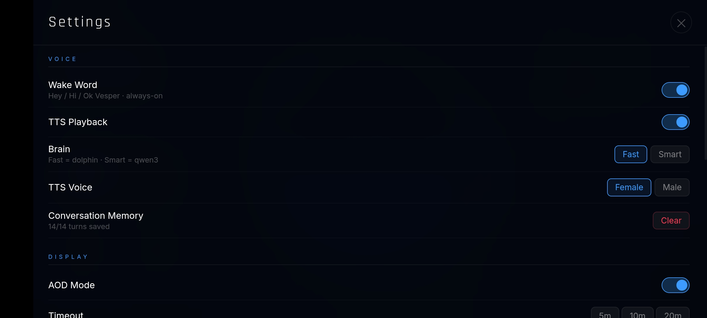
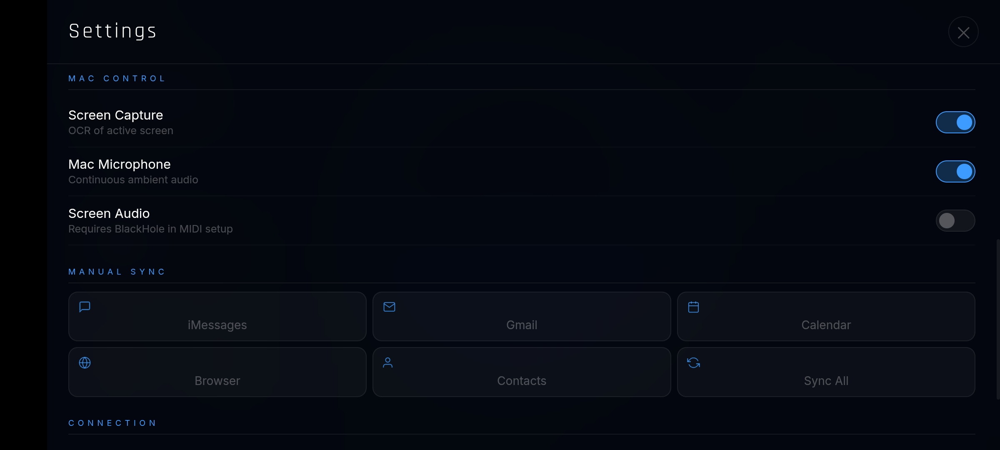

<div align="center">

<br>

<pre align="center">
 ██╗   ██╗███████╗███████╗██████╗ ███████╗██████╗
 ██║   ██║██╔════╝██╔════╝██╔══██╗██╔════╝██╔══██╗
 ██║   ██║█████╗  ███████╗██████╔╝█████╗  ██████╔╝
 ╚██╗ ██╔╝██╔══╝  ╚════██║██╔═══╝ ██╔══╝  ██╔══██╗
  ╚████╔╝ ███████╗███████║██║     ███████╗██║  ██║
   ╚═══╝  ╚══════╝╚══════╝╚═╝     ╚══════╝╚═╝  ╚═╝
</pre>
### *A personal AI that actually knows your life.*

Ingests your messages, emails, calendar, screen activity, and contacts into a local vector database.  
Query it by voice at your desk, via WhatsApp from anywhere, or on an always-on kiosk display.  
**No cloud. No subscriptions. Nothing leaves your house.**

<br>

[](https://python.org)
[](https://nodejs.org)
[](https://flask.palletsprojects.com)
[](https://ollama.com)
[](https://trychroma.com)
[](https://tailscale.com)
[]()
[](LICENSE)

<br>

> ⚠️ **This is a living project.** Things break, get rebuilt, and evolve. The README reflects the current state — not a finished product. Building in public.

</div>

---

## 🤔 Why does this exist?

Every AI assistant you talk to is completely stateless.

Ask it what you were working on last Tuesday — it doesn't know.  
Ask about someone you've been texting — it doesn't know.  
Ask it to recall that email from last week — it doesn't know.

Cloud AI (ChatGPT, Siri, Google Assistant) either stores nothing useful or stores *everything* on their servers — training on your private conversations to improve their products.

**Vesper is an attempt at something different:**

| | Cloud AI | Vesper |
|---|:---:|:---:|
| Reads your messages & emails | ✗ | ✅ |
| Knows your calendar | ✗ | ✅ |
| Knows who people in your life are | ✗ | ✅ |
| Remembers what you were doing last Tuesday | ✗ | ✅ |
| Data stays on your hardware | ✗ | ✅ |
| Works fully offline | ✗ | ✅ |
| Costs per query | 💸 | ✗ |
| Gets smarter about *you* over time | ✗ | ✅ |

The result feels less like a search engine and more like an assistant that's been quietly paying attention to your life for months.

---

## 🖥️ Kiosk UI

*Always-on desk display running on an OnePlus Nord (Fully Kiosk Browser, landscape, permanently mounted).*

<br>

**Home** — Three.js orb, real-time clock, tasks, weather


<br>

**Memory** — ChromaDB memory count, breakdown by source


<br>

**System** — Live CPU, RAM, GPU utilisation, VRAM, temperature


<br>

**Settings**




<br>

---

## 🏗️ Architecture

```
┌──────────────────────────── HOME NETWORK ────────────────────────────────┐
│                                                                            │
│   MacBook Pro M4 Pro                  VESPER SERVER (Asus i5 / MX130)    │
│   ─────────────────────               ─────────────────────────────────   │
│   vesper_capture.py  ──────────────►  file_receiver.py  (Flask HTTPS)    │
│   vesper_audio.py    ──────────────►    ├─ ChromaDB  (vesper_life)       │
│   gmail_realtime.py  ──────────────►    │  12,000+ memories              │
│   export_*.sh / .py  (crons) ──────►    ├─ Ollama  (LLM + embeddings)   │
│                                         ├─ Piper TTS  (CPU)              │
│   OnePlus Nord  (kiosk)                 └─ faster-whisper  (CPU)         │
│   ─────────────────────                                                   │
│   kiosk.html ◄──────────────────────────  /voice_fast  (SSE stream)     │
│   Three.js orb                            /kiosk  (serves HTML)         │
                                                                          │
│                                                                            │
│   WhatsApp ◄────────────────────────────  openclaw/bot.js  (Baileys)    │
│   Indian # — ingests + replies            responds only to OWNER_JID    │
│   to owner only                                                           │
│                                                                            │
│   WhatsApp Business ◄───────────────────  openclaw/bot_us.js            │
│   US # — silent ingest only               no replies, pure capture      │
│                                                                            │
└────────────────────────────────────────────────────────────────────────────┘
```


> 🔒 **The cardinal rule:** `file_receiver.py` is the **only** process that ever writes to ChromaDB. Every other script POSTs to its HTTP API. This was a hard lesson — concurrent writes caused `hnswlib` segfaults that corrupted the entire EXT4 filesystem and required a full server rebuild from scratch.

---

## 🔧 Hardware

### Why old hardware?

Both devices were sitting around unused. Total additional cost: **£0**.

The server is a **2018 Asus Vivobook** running Ubuntu, converted to a home server. The kiosk is an **OnePlus Nord** permanently mounted on the desk, always plugged in.

### 🖥️ Server — AI Compute

| Component | Spec |
|-----------|------|
| CPU | Intel Core i5-8250U · 4 cores / 8 threads |
| RAM | 16 GB DDR4 |
| GPU | NVIDIA MX130 · Maxwell (sm_5.0) · 2 GB VRAM |
| Storage | External HDD · 657 GB at `/mnt/hdd/` |
| OS | Ubuntu Linux |
| Network | LAN `10.0.0.x` · Tailscale `100.x.x.x` |

### ⚠️ The Maxwell Problem

The MX130 is Maxwell architecture (sm_5.0). Nearly every modern CUDA AI library requires Pascal (sm_6.0+). This constraint shaped every single model choice in the stack:

| Library | Needs | MX130 Result |
|---------|-------|-------------|
| Kokoro TTS *(wanted)* | sm_6.0+ | `cuDNN EXECUTION_FAILED` ❌ |
| CTranslate2 Whisper CUDA | sm_6.0+ | crashes on load ❌ |
| PyTorch CUDA general | sm_6.0+ | limited ❌ |
| Ollama (llama.cpp) | sm_5.0+ | ✅ works |

So: LLM inference uses Ollama on GPU. TTS and STT run entirely on CPU.

### 💻 Mac — Data Capture Only

Apple Silicon MacBook Pro. No inference runs here — it's purely a data collector. Exports iMessages, Calendar, Contacts, and Notes via AppleScript and `osascript`. Runs screen OCR via Apple Vision framework (same engine macOS uses for Live Text).

### 📱 OnePlus Nord — Kiosk

6.44" AMOLED, always plugged in, permanently desk-mounted in landscape. Runs Fully Kiosk Browser (free tier) locked to `https://server:5000/kiosk`. Connected via Tailscale for off-network access.

---

## 🧠 Memory — How ChromaDB Works

[ChromaDB](https://www.trychroma.com/) is an open-source vector database. Every piece of data ingested into Vesper becomes a *memory* — a document stored with its 768-dimensional embedding vector.

When you ask Vesper a question:

```
Your question
     │
     ▼  nomic-embed-text → 768-dim vector
     │
     ▼  Cosine similarity search across 12,000+ memory vectors
     │
     ▼  Most semantically relevant memories returned
     │
     ▼  LLM synthesises a response using that context
```

This is why *"what did my friend say about the concert?"* finds the right WhatsApp message — even if you didn't use the exact words from the original message.

### Memory Schema

Every memory is stored with:

```python
{
    "document": "the actual text content",
    "metadata": {
        "category":  "whatsapp" | "email_received" | "screen_ocr" | "contact" | ...,
        "source":    "whatsapp:PersonName" | "screen:AppName" | ...,
        "timestamp":  1748000000   # unix timestamp — enables "what happened last Tuesday?" queries
    }
}
```

### Single-Writer Constraint

ChromaDB's `hnswlib` C++ index segfaults under concurrent writes from multiple processes. Vesper enforces strict single-writer architecture — only `file_receiver.py` ever touches the database. A `threading.Lock()` inside it serialises every read and write. All ingest scripts are HTTP clients only.

---

## 📡 Data Pipelines

Every pipeline writes to ChromaDB via `file_receiver.py`. The `timestamp` metadata on each memory enables time-filtered queries like *"what did I do last Tuesday?"*

### ⚡ Real-Time Ingestion

| Source | How | Latency | Memories |
|--------|-----|---------|----------|
| Gmail | IMAP IDLE — server push the moment email arrives | < 5s | ~1,300 |
| WhatsApp (Indian #) | Baileys hook — fires on every received message | instant | ~1,700+ |
| WhatsApp Business (US #) | bot_us.js — ingest-only, no replies | instant | growing |
| Screen Activity | Apple Vision OCR — triggers on each app switch | ~2s | ~1,100+ |

### ⏱️ Mac Cron Jobs

| Source | Schedule | Category tag | Memories |
|--------|----------|-------------|----------|
| iMessages | every 15 min | `imessage` | ~240+ |
| Browser history | every 30 min | `browser` | ~2,000 |
| Calendar events | hourly | `calendar` | ~15 |
| Contacts | daily 3 AM | `contact` | 908 |

### 🔄 Server-Side Scheduled Jobs

| Job | Runs | What it does |
|-----|------|-------------|
| `proactive_alerts.py` | every 30 min | Scans for urgent or unanswered messages → sends WhatsApp push notification |
| `morning_briefing.py` | 8 AM daily | Assembles a personalised summary of the day → sends to WhatsApp |
| `night_batch.py` | 2 AM daily | Re-transcribes the day's audio with `whisper-medium` (higher quality than real-time) |
| Watchdog | every 5 min | `curl /health` — kills and restarts server on timeout |
| Bot keepalive | every 2 min | `pgrep bot.js \|\| start bot.js` |

---

## 🤖 AI Model Stack

### Language Models

| Model | Ollama tag | Used for | GPU layers | Speed |
|-------|------------|----------|-----------|-------|
| **dolphin-phi 2.7B** | `dolphin-voice` | All voice queries | 22/32 on MX130 | ~15 tok/s |
| **Qwen3 4B** | `qwen3-ask` | WhatsApp `/model qwen3` | CPU only | ~5 tok/s |

**Why dolphin-phi?** Based on Microsoft Phi-2 — small, fast, uncensored (no refusals on personal questions about relationships or private life), and partially fits on the MX130 GPU at 22/32 layers. Fast enough for real conversation.

**Why Qwen3 for WhatsApp?** Better reasoning and a 32K context window vs Phi-2's 2K. Used only on demand via `/model qwen3` where latency matters less than quality.

### Embeddings

| Model | Runs on | VRAM | Always loaded? |
|-------|---------|------|---------------|
| `nomic-embed-text` (768-dim) | GPU | 555 MB | Yes — never evicted from memory |

Every ChromaDB query and every ingest call goes through this. ~50–80ms per embed.

### 🎤 Speech-to-Text

| Model | Mode | Real-time factor | Used for |
|-------|------|-----------------|---------|
| `distil-whisper-small.en` (int8) | CPU | 0.74x | Live kiosk queries, WhatsApp voice notes |
| `whisper-medium` | CPU | ~1.8x | Night batch — higher quality re-transcription of the day's audio |

RTF 0.74x means a 3-second clip takes ~2.2 seconds to transcribe. Can't use GPU (Maxwell/CTranslate2 incompatibility).

### 🔊 Text-to-Speech

| Model | Mode | Latency per sentence |
|-------|------|---------------------|
| **Piper** `hfc_female-medium` / `ryan-high` | CPU | 62–220ms |
| Supertonic-3 | CPU | 330–830ms (fallback) |

Kokoro TTS was the target (near-human quality, ~50ms on GPU) but fails with `cuDNN EXECUTION_FAILED` on Maxwell. Piper is the best CPU-native option available.

### 📊 VRAM Budget

```
nomic-embed-text  (always resident):    555 MB
dolphin-phi  22/32 GPU layers:        ~1,100 MB
──────────────────────────────────────────────
Peak total:                           ~1,655 MB  /  2,048 MB   ← 393 MB headroom
```

---

## 🎙️ Voice Pipeline

**Latency journey: 25 seconds → 1.5 seconds**

### End-to-End Flow

```
"Hey Vesper"
     │
     ├─ Fast-whisper (wake word detection, continuous mode, lightweight)
     │
     ├─ VAD detects speech start  (RMS threshold > 0.015)
     │
     ├─ MediaRecorder starts  (WebM/Opus)
     │
     ├─ POST /voice_prepare  ← fires while user is still speaking
     │     → server pre-embeds the partial transcript
     │     → ChromaDB results cached before user finishes talking
     │
     ├─ 1.4s of silence → recording stops
     │
     ├─ Audio blob → base64 → POST /voice_fast
     │     → Whisper STT     (~2s for a 3s clip on CPU)
     │     → nomic-embed     (cache hit from /voice_prepare)
     │     → ChromaDB search
     │     → Query routing   (see table below)
     │     → dolphin-phi generates response
     │
     └─ At every comma / period → Piper TTS fires on that chunk immediately
           → SSE stream chunks:
               data: T:<base64_text>   ← subtitle displayed instantly
               data: A:<base64_wav>    ← AudioContext plays the chunk
           → First audio plays < 1 second after LLM starts generating
```

### 🚦 Query Routing — First Match Wins

| Path | When it fires | Latency |
|------|--------------|---------|
| ⚡ **Fast path** | Time, identity, greetings, weather, memory count | < 50ms — zero LLM, zero ChromaDB |
| 🗃️ **Data lookup** | Last message from X, calendar, contacts, recent screen activity | 200–800ms — ChromaDB only, no LLM |
| 🧠 **LLM synthesis** | Complex personal queries needing reasoning | 1.5–2.5s — ChromaDB + dolphin-phi |
| 🚫 **Anti-hallucination guard** | No relevant memories found for a personal query | Explicit refusal — never guesses |

### 💡 The Key Optimisation: Comma-Split TTS

Instead of waiting for the full LLM response to finish generating before starting speech synthesis, Vesper fires Piper TTS at every natural pause — comma, period, semicolon. First audio chunk plays ~600ms after the LLM starts.

**Effect: 5.3s → 2.0s** for memory-lookup queries.

### 📉 Latency Evolution

| Optimisation | First-word latency |
|-------------|-------------------|
| Baseline — Qwen3 4B, CPU only | 9–25s |
| dolphin-phi, 22/32 layers on GPU | 3.5s |
| Shorter system prompt | 2.8s |
| Comma-split TTS streaming | 2.0s |
| Fast paths (time / greetings / identity) | < 0.5s |
| `/voice_prepare` pre-computation | **1.5–1.7s** |

---

## 💬 OpenClaw — WhatsApp Bot

Named after the unofficial WhatsApp Web client it's built on: [Baileys](https://github.com/WhiskeySockets/Baileys) — a Node.js implementation of the WhatsApp Web binary protocol. No official WhatsApp API supports automated access on personal numbers.

### Two-Bot Setup

**`bot.js`** — Indian number, personal WhatsApp (619 lines)
- Silently ingests every received message into ChromaDB
- `OWNER_JID` gate — only the US number gets LLM responses. Everyone else (family, friends) is ingested silently. *(This gate was added after the bot replied "Yeah, I'm right here!" into the middle of a personal conversation.)*
- Runs a small HTTP server on port 5001 for outbound messages (used by `morning_briefing.py` and `proactive_alerts.py`)

**`bot_us.js`** — US WhatsApp Business number (140 lines)
- Ingest-only. Never replies to anyone.
- Captures all US-side conversations — professional contacts, etc.

### What It Can Handle

| Message type | What Vesper does |
|-------------|-----------------|
| 💬 Text | Answers via LLM with memory context |
| 🎤 Voice note | Downloads → Whisper → LLM answer |
| 📸 Photo | LLM vision → describes + stores as memory |
| 🔗 URL / article link | Fetches the page → summarises |
| `"remember [fact]"` | Regex match → stores directly to ChromaDB |
| `/model qwen3` | Switches to Qwen3 (smarter, 32K context, slower) |
| `/model dolphin` | Switches back to dolphin-phi (fast) |
| `/clear` | Clears the conversation history for this session |

Conversation history (last 6 turns) is persisted per-JID in `history.json` — multi-turn conversations work across restarts.

---

## 👁️ Screen Activity — `vesper_capture.py`

Uses Apple's native **Vision framework** (via PyObjC) for OCR — the same engine macOS uses for Live Text:

1. Watches `NSWorkspace` application activation events
2. On each app switch or significant window change, takes a screenshot
3. Runs Apple Vision OCR (faster than Tesseract, runs on Apple Neural Engine)
4. Strips UI chrome, menus, and navigation noise via heuristics
5. POSTs `{app_name, ocr_text, timestamp}` to `/store_ocr`

Vesper now has a fully searchable record of every app, document, code file, article, and video you engaged with — stored as `screen_ocr` memories tagged with the app name.

---

## 🖼️ The 3D Orb — `kiosk.html`

A single self-contained HTML file, 1,360 lines. Zero build step. Zero npm. Served by Flask at `/kiosk`.

Built with **Three.js r128** and a custom GLSL fragment shader:

- Inner sphere with procedural sine-wave displacement simulating an ocean surface
- Deep navy blue base with cyan rim glow — shifts to green during listening, white burst on wake
- Wireframe grid overlay at 9% opacity
- 220-particle cloud orbiting the sphere
- Equatorial glow ring
- 0.6Hz breathing pulse (scale oscillates 1.0–1.012)
- **Audio-reactive** — RMS of live mic input scales the orb in real-time during recording

### State Machine

```
idle ──► listening ──► thinking ──► responding ──► idle
```

Each state change updates orb colour/animation intensity, shows/hides subtitle text, and manages AudioContext scheduling.

### Always-On Display (AOD)

After 10 minutes idle → pure black background, large ultra-thin clock, breathing 48px orb, soft pulsing hint. Wake word detection continues running through AOD.

---

## 🌐 Remote Access — Tailscale

Tailscale creates a WireGuard-based mesh VPN. The server gets a stable IP and hostname (`vesper-server.tail614590.ts.net`).

- Access Vesper from anywhere — not just home LAN
- The Nord kiosk switches from LAN IP to Tailscale hostname when off-network
- SSH from anywhere: `ssh tanmay@100.x.x.x`
- Tailscale issues a **trusted TLS certificate** for the server hostname — no self-signed cert warning on remote devices

Cron renews the cert monthly: `tailscale cert <hostname>` + server restart.

---

## 🗺️ `file_receiver.py` — Route Map

The entire server in one file. Flask HTTPS on port 5000. 1,645 lines. 22 routes. The only process that writes to ChromaDB.

| Route | Method | What it does |
|-------|--------|-------------|
| `/health` | GET | `{"status":"ok","memories":N}` — polled by watchdog |
| `/system_stats` | GET | Live CPU, RAM, GPU util/VRAM/temp, disk, uptime |
| `/ingest` | POST | Async memory write — 202, queued in ThreadPoolExecutor |
| `/store_memory` | POST | Sync memory write — blocks until ChromaDB confirms |
| `/store_ocr` | POST | Screen OCR storage with `app_name` metadata |
| `/voice_fast` | POST | Main voice endpoint — SSE stream of text + audio chunks |
| `/voice_prepare` | POST | Pre-embeds partial transcript while user is still speaking |
| `/transcribe` | POST | Base64 WAV → Whisper text |
| `/transcribe_partial` | POST | Streaming partial transcript for live kiosk subtitle |
| `/ask` | POST | WhatsApp deep-query via Qwen3 (90s timeout) |
| `/recall` | POST | Raw ChromaDB query, no LLM |
| `/ambient_context` | GET | Recent screen activity for kiosk sidebar |
| `/kiosk` | GET | Serves `kiosk.html` |
| `/ui` | GET | Serves `voice_ui.html` |

**Threading model:**
- `_chroma_lock` (`threading.Lock`) — all ChromaDB reads and writes, one at a time
- `_llm_sem` (`threading.Semaphore(1)`) — one LLM inference at a time in `/ask`
- `_executor` (`ThreadPoolExecutor(max_workers=2)`) — async `/ingest` queue

---

## 📁 Repository Structure

```
vesper/
│
├── client/                               # Mac-side — data capture only, no inference
│   ├── vesper_capture.py                 # Screen OCR daemon (Apple Vision + PyObjC)
│   ├── vesper_audio.py                   # 24/7 mic recording in 30s WAV chunks
│   ├── vesper_screen.py                  # Screenshot helper
│   ├── vesper_phone.py                   # Phone call detection
│   ├── gmail_realtime.py                 # IMAP IDLE — real-time email ingest
│   ├── file_watcher.py                   # Export queue → server (dedup via indexed_state.json)
│   ├── imessage_realtime.sh              # Near-real-time iMessage monitor (~30s latency)
│   ├── export_imessages.sh               # iMessage SQLite → JSON
│   ├── export_gmail.sh / .py             # Gmail IMAP → JSON
│   ├── export_browser.sh                 # Chrome + Safari SQLite → JSON
│   ├── export_calendar.sh                # Apple Calendar via osascript
│   ├── export_contacts.sh                # Contacts VCF via osascript
│   ├── export_notes.sh                   # Apple Notes via osascript
│   ├── export_whatsapp.sh / .py          # WhatsApp chat export parser
│   ├── export_instagram.py               # Instagram ZIP parser  ⚠️ currently broken
│   ├── com.vesper.gmail_realtime.plist   # LaunchAgent — auto-restarts gmail daemon on reboot
│   └── frontend/
│       └── kiosk.html                    # Complete kiosk UI — Three.js orb, SSE, VAD (1,360 lines)
│
└── server/                               # Server-side — AI inference + vector storage
    ├── file_receiver.py                  # Flask HTTPS, ChromaDB, LLM routing (1,645 lines, 22 routes)
    ├── morning_briefing.py               # 8 AM daily WhatsApp summary
    ├── night_batch.py                    # 2 AM whisper-medium re-transcription
    ├── proactive_alerts.py               # 30-min priority push alerts
    ├── memory_client.py                  # HTTP client library shared by all ingest scripts
    ├── ingest_browser.py
    ├── ingest_calendar.py
    ├── ingest_contacts.py
    ├── ingest_gmail.py
    ├── ingest_imessages.py
    ├── ingest_whatsapp.py
    ├── ingest_instagram_smart.py
    ├── ask_vesper.py                     # CLI tool for quick terminal queries
    └── openclaw/
        ├── bot.js                        # Indian # WhatsApp bot — ingest + owner replies (619 lines)
        └── bot_us.js                     # US # WhatsApp bot — silent ingest only (140 lines)
```

---

## 🔒 Privacy

Everything ingested stays in ChromaDB on the home server. Here's every external call Vesper makes:

| Source | Synced | Leaves home network? |
|--------|--------|---------------------|
| iMessages | ✅ | Never — reads `chat.db` directly |
| Gmail | ✅ | Never — IMAP only |
| WhatsApp (Indian #) | ✅ | Via Meta's servers (unavoidable) |
| WhatsApp Business (US #) | ✅ | Via Meta's servers |
| Screen activity | ✅ | Never |
| Browser history | ✅ | Never — reads SQLite directly |
| Apple Calendar | ✅ | Never |
| Contacts | ✅ | Never |
| Apple Notes | ✅ | Never |
| Mic / ambient audio | ✅ | Never — stays on `/mnt/hdd` |
| Instagram | ⚠️ Broken | Would stay local |
| Weather | ✅ | wttr.in — anonymous |
| Web search | ✅ | DuckDuckGo — anonymous |

**Nothing goes to OpenAI, Anthropic, Google, or any cloud AI.** All inference — LLM, embeddings, STT, TTS — runs locally via Ollama + Piper + faster-whisper.

---

## 🚧 Known Issues & Limitations

| Issue | Why | Workaround |
|-------|-----|-----------|
| No iPhone screen capture | iOS blocks background OCR API access for third-party apps | Send screenshots to Vesper via WhatsApp |
| WhatsApp Baileys ToS risk | Unofficial protocol — Meta could block the session | Manual export fallback via `export_whatsapp.py` |
| GPU = Maxwell sm_5.0 | Blocks Kokoro TTS, CTranslate2 Whisper, modern CUDA libs | Accepted — CPU fallback for TTS + STT |
| iMessage 15-min lag | No real-time hook into Messages.app | `imessage_realtime.sh` gets it to ~30s |
| ChromaDB single-writer only | hnswlib segfaults under concurrent writes | Enforced by architecture — `_chroma_lock` |
| Instagram ingest broken | Exported JSON corrupted at line 356,333 | Re-download export or use `ingest_instagram_smart.py` |
| Audio memories have overnight lag | Night batch runs at 2 AM | Real-time audio indexing is on the roadmap |
| SSL cert on Android | Self-signed cert requires manual install | Tailscale cert removes this for remote access |

### What Already Scales Well

| Component | Today | Can grow to |
|-----------|-------|------------|
| ChromaDB memories | 12,000 | 1M+ — HNSW index is O(log n) |
| LLM | dolphin-phi 2.7B | Any Ollama model — one tag change |
| Data sources | 10 | Unlimited — any script + HTTP POST |
| Kiosk displays | 1 | Any number of devices pointing at the server |
| WhatsApp numbers | 2 | Unlimited — each bot gets its own `auth/` dir |

---

## 🔭 What's Being Built Next

### 🎧 Wearable Audio Diary

A tiny wearable microcontroller (targeting Seeed XIAO nRF52840 — already have the board) worn on the body. Records ambient audio continuously. Clips stream over BLE to the server where Whisper transcribes, pyannote diarizes speakers, and memories are stored with context tags.

The goal: Vesper remembers your conversations, meetings, and phone calls — not just what you typed.

Full pipeline: **speaker diarization** (who said what?) → **context classifier** (meeting / phone call / background TV / private?) → **semantic chunking** → ChromaDB `audio_diary` category.

> *"What did I say about the project on Monday?"*
> *"Who called me yesterday?"*
> *"Summarise my conversations this week."*

`vesper_audio.py` on the Mac is already the desktop version of this — it records 24/7 in 30s chunks and re-transcribes overnight with `whisper-medium`. The wearable extends that to anywhere.

### 📣 Proactive Intelligence

Currently fully query-driven. The next step is Vesper surfacing things without being asked:

> *"Priya texted twice in the last hour — you haven't replied."*
> *"You have a meeting in 20 minutes."*
> *"You've been on the same task for 3 hours (screen activity)."*

`proactive_alerts.py` is the early sketch of this. Full proactive mode means per-source urgency thresholds, smart deduplication, and time-of-day delivery rules.

### 🕸️ Relationship Memory Graph

A structured per-person view synthesised from all messages, emails, and iMessages: contact frequency over time, common topics, sentiment trend, and drift detection (*"I haven't heard from X in a while"*).

### ⚡ Hardware Upgrade Path

With a GTX 1650 Ti or better (sm_7.5+):

| Component | Current | With better GPU |
|-----------|---------|----------------|
| TTS (Kokoro) | CPU, 62–220ms | GPU, < 100ms, near-human quality |
| STT (Whisper medium) | CPU, ~1.8x RTF | GPU, < 500ms |
| Full voice round-trip | 1.5–2.5s | **sub-1-second** |

---

## ⚡ Quick Reference

```bash
# SSH into server
ssh tanmay@10.0.0.x          # LAN
ssh tanmay@100.x.x.x         # Tailscale (from anywhere)

# Health check
curl -sk https://127.0.0.1:5000/health
curl -sk https://127.0.0.1:5000/system_stats

# Restart server gracefully (won't drop your SSH session)
kill -15 $(pgrep -f file_receiver.py | head -1)
sleep 3 && rm -f /tmp/vesper_receiver.lock
nohup python3 /home/tanmay/vesper/pipelines/file_receiver.py \
  >> /home/tanmay/vesper/logs/file_receiver.log 2>&1 &

# Tail logs
tail -f /home/tanmay/vesper/logs/file_receiver.log
tail -f /home/tanmay/vesper/logs/openclaw.log

# Kiosk URL
# LAN:       https://10.0.0.x:5000/kiosk
# Tailscale: https://vesper-server.tail614590.ts.net:5000/kiosk
```

---

## 📜 License

MIT — see [LICENSE](LICENSE) for full terms.

---

<div align="center">

<br>

Built by **[Tanmay Pramanick](https://github.com/tanmayypramanick)**

[tanmaypramanick.vercel.app](https://tanmaypramanick.vercel.app) · [linkedin.com/in/tanmaypramanick](https://linkedin.com/in/tanmaypramanick)

<br>

*A personal AI for one person. On hardware you already own. Still building.*

</div>
